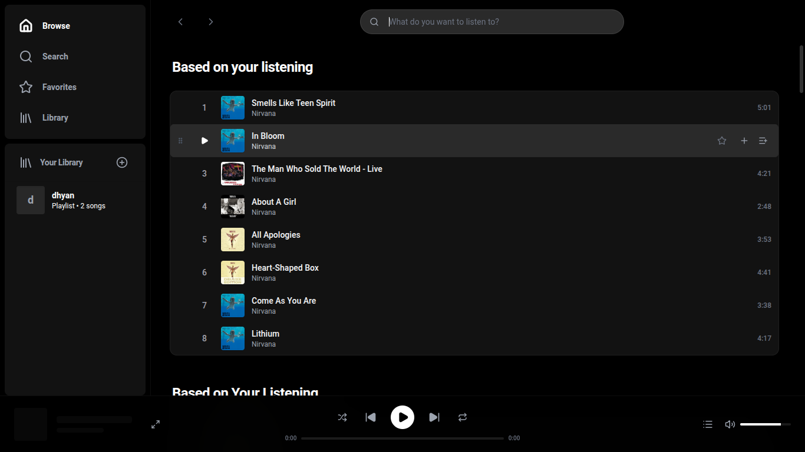
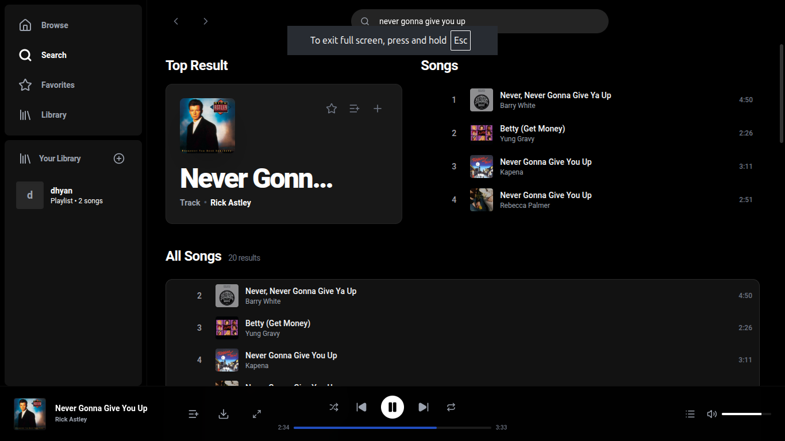
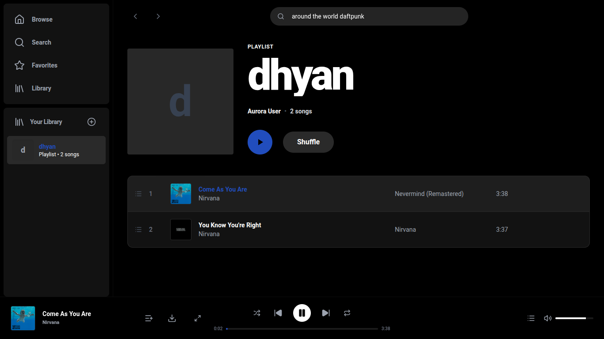

<div align="center">

# 🎵 Aurora Music Player


**A stunning, full-featured music streaming application built with modern web technologies**

<!-- Core Badges -->
[](LICENSE)
[](https://www.electronjs.org/)
[](https://reactjs.org/)
[](https://nodejs.org/)

<!-- Build & Quality Badges -->
[](CONTRIBUTING.md)
[](https://prettier.io/)
[](https://github.com/dhyaan1902/Aurora/graphs/commit-activity)
[](https://github.com/dhyaan1902/Aurora)

<!-- Tech Stack Badges -->
[](https://vitejs.dev/)
[](https://tailwindcss.com/)
[](https://expressjs.com/)
[](https://www.sqlite.org/)

[✨ Features](#-features) • [🚀 Quick Start](#-quick-start) • [📸 Screenshots](#-screenshots) • [🛠 Tech Stack](#-tech-stack) • [⚡ Performance](#-performance)

---

**Experience music streaming like never before - Free, Beautiful, and Powerful**

*Because even your ears deserve premium treatment* 🎧

</div>

---

## 🌟 Why Aurora?

Aurora combines the **metadata richness of Spotify** with the **free streaming of YouTube Music** to create a premium music player that doesn't cost a penny. Built as a native desktop application, it offers:

- 🎨 **Stunning UI** - macOS-inspired design with smooth animations *(No bugs were harmed in the making of this interface)*
- 🎵 **Free Streaming** - Millions of songs, zero subscription *(Works better than your gym membership)*
- 📝 **Live Lyrics** - Synced lyrics that flow with your music
- 🚀 **Lightning Fast** - Hardware-accelerated, optimized performance *(Faster than npm install)*
- 🎯 **Complete Features** - Everything you'd expect from a premium player

---

## 📸 Screenshots

<div align="center">

### 🏠 Main Interface

*Beautiful, clean interface with smooth transitions - Because pixels matter*

### 📝 Playlist & Queue Management

*Organize your music with drag-and-drop - Moving pixels has never been easier*

### 🎤 Fullscreen Player with Live Lyrics

*Immersive experience with auto-scrolling synced lyrics - Like karaoke, but cooler*

### 🎨 Browse & Discover

*Explore your personalized feed and discover new music*

</div>

---

## ✨ Features

### 🎼 Music Playback
<table>
<tr>
<td width="50%">

**Core Playback**
- ✅ High-quality YouTube Music streaming
- ✅ Instant playback with prefetching
- ✅ Gapless transitions
- ✅ Repeat (Off/All/One)
- ✅ Shuffle mode
- ✅ Volume control & mute

</td>
<td width="50%">

**Advanced Features**
- ✅ Smart prefetching (next 5 tracks)
- ✅ Queue management
- ✅ Drag-and-drop reordering
- ✅ Background playback
- ✅ Cross-fade support (coming soon)
- ✅ Equalizer (coming soon)

</td>
</tr>
</table>

### 📚 Library & Organization
<table>
<tr>
<td width="50%">

**Playlists**
- ✅ Create unlimited playlists
- ✅ Add/remove tracks
- ✅ Drag-and-drop reordering
- ✅ Shuffle playlists
- ✅ Export/import (coming soon)

</td>
<td width="50%">

**Collections**
- ✅ Favorite tracks & albums
- ✅ Play history
- ✅ Offline downloads
- ✅ Smart collections (coming soon)
- ✅ Auto-generated playlists (coming soon)

</td>
</tr>
</table>

### 🔍 Discovery
- 🎯 **Smart Search** - Find tracks, albums, and artists instantly
- 🎨 **Personalized Feed** - Recommendations based on listening history
- 🎭 **Browse Categories** - Discover new music by genre and mood
- 🌟 **Featured Playlists** - Curated selections
- 📊 **Trending** - What's hot right now (coming soon)

### 📝 Lyrics Experience
- ✨ **Auto-scrolling synced lyrics** - Perfectly timed with music
- 🎯 **Click to seek** - Jump to any part of the song
- 🚀 **Hardware accelerated** - Butter-smooth scrolling
- 🎨 **Beautiful animations** - Elegant text transitions
- 📖 **Fallback support** - Auto-generated lyrics when needed

### 🎨 User Interface
- 🌙 **Dark Theme** - Easy on the eyes
- ⚡ **Smooth Animations** - GPU-accelerated transitions
- 🖱️ **Intuitive Controls** - Everything where you expect it
- 📱 **Responsive Design** - Works on any screen size
- 🎯 **Keyboard Shortcuts** - Coming soon
- 🎨 **Customizable** - Themes coming soon

---

## 🚀 Quick Start

### Prerequisites

```bash
Node.js 16+ • npm/yarn • yt-dlp (auto-installed)
# Coffee ☕ (required for debugging)
```

### Installation

```bash
# Clone the repository (the fun begins)
git clone https://github.com/dhyaan1902/Aurora.git
cd Aurora

# Install dependencies (time for that coffee)
npm install
cd backend && npm install && cd ..
cd frontend && npm install && cd ..

# Set up environment (optional but recommended)
cd backend
echo "SPOTIFY_CLIENT_ID=your_id_here" > .env
echo "SPOTIFY_CLIENT_SECRET=your_secret_here" >> .env
cd ..
```

> 🔑 Get Spotify credentials at [Spotify Developer Dashboard](https://developer.spotify.com/dashboard)
> 
> 💡 **Pro Tip:** The app works without Spotify credentials, but you'll miss out on rich metadata!

### Development

```bash
# Terminal 1: Backend
cd backend && npm run dev

# Terminal 2: Frontend  
cd frontend && npm run dev

# Terminal 3: Electron (optional)
npm start
```

Visit `http://localhost:5173` in your browser!

### Production Build

```bash
# Build frontend
cd frontend && npm run build && cd ..

# Package desktop app
npm run dist           # Linux AppImage
npm run dist:win       # Windows installer
npm run dist:mac       # macOS DMG
```

---

## 🛠 Tech Stack

<div align="center">

### Frontend
[](https://reactjs.org/)
[](https://vitejs.dev/)
[](https://tailwindcss.com/)
[](https://www.framer.com/motion/)

### Backend
[](https://nodejs.org/)
[](https://expressjs.com/)
[](https://www.sqlite.org/)
[](https://github.com/yt-dlp/yt-dlp)

### Desktop
[](https://www.electronjs.org/)
[](https://www.electron.build/)

</div>

### Architecture

```
┌─────────────────────────────────────────────────────────┐
│                    Electron App                         │
├─────────────────────────────────────────────────────────┤
│                                                         │
│  ┌──────────────┐         ┌─────────────────────────┐  │
│  │   React UI   │ ◄────► │   Express Backend       │  │
│  │              │         │                         │  │
│  │  - Components│         │  - RESTful API          │  │
│  │  - State     │         │  - SQLite Database      │  │
│  │  - Routing   │         │  - yt-dlp Integration   │  │
│  │  - Styles    │         │  - Spotify API Client   │  │
│  └──────────────┘         └─────────────────────────┘  │
│         │                            │                  │
│         │                            │                  │
│         ▼                            ▼                  │
│  ┌──────────────┐         ┌─────────────────────────┐  │
│  │ HTML5 Audio  │         │  External Services      │  │
│  │   Element    │         │  - Spotify Web API      │  │
│  └──────────────┘         │  - YouTube Music        │  │
│                           └─────────────────────────┘  │
└─────────────────────────────────────────────────────────┘
```

---

## 📁 Project Structure

```
Aurora/
├── 📱 frontend/              # React application
│   ├── src/
│   │   ├── components/      # React components
│   │   │   ├── ConfirmationModal.jsx
│   │   │   ├── CreatePlaylistModal.jsx
│   │   │   ├── FullScreenPlayer.jsx
│   │   │   ├── PlayerBar.jsx
│   │   │   ├── Sidebar.jsx
│   │   │   └── UI.jsx       # Reusable components
│   │   ├── App.jsx          # Main application
│   │   ├── App.css          # Component styles
│   │   ├── index.css        # Global styles
│   │   └── main.jsx         # Entry point
│   └── package.json
│
├── 🔧 backend/               # Node.js Express server
│   ├── routes/              # API endpoints
│   │   ├── browse.js        # Browse & recommendations
│   │   ├── download.js      # Download management
│   │   ├── favorites.js     # Favorites system
│   │   ├── feed.js          # Personalized feed
│   │   ├── lyrics.js        # Lyrics fetching
│   │   ├── play.js          # Stream URL generation
│   │   ├── playlists.js     # Playlist CRUD
│   │   ├── queue.js         # Queue prefetching
│   │   ├── search.js        # Search functionality
│   │   └── stream.js        # Audio streaming
│   ├── utils/
│   │   ├── db.js            # SQLite database
│   │   ├── spotify.js       # Spotify API client
│   │   └── ytHelper.js      # YouTube integration
│   ├── downloads/           # Downloaded tracks
│   └── server.js            # Express server
│
├── 🖥️ main.js                # Electron main process
├── 📦 dist-electron/         # Packaged applications
├── 📄 README.md              # This file
├── 📜 LICENSE                # MIT License
└── 📋 package.json           # Root dependencies
```

---

## ⚡ Performance

Aurora is built for **speed and smoothness**:

### Optimization Techniques
- ✅ **Hardware Acceleration** - GPU-powered animations
- ✅ **Smart Prefetching** - Next 5 tracks pre-loaded
- ✅ **Efficient Rendering** - React optimization patterns
- ✅ **Cached Requests** - Reduced API calls
- ✅ **Lazy Loading** - Load what you need, when you need it
- ✅ **Image Optimization** - Responsive image loading

### Build Stats
```
📦 Production Build
├── HTML:    0.44 kB (gzipped: 0.30 kB)
├── CSS:    33.32 kB (gzipped: 6.77 kB)
└── JS:    381.62 kB (gzipped: 117.59 kB)

⚡ Total:   ~124 kB gzipped
💡 That's smaller than most website hero images!
```

---

## 🎮 Usage Guide

### Basic Controls

| Action | Control |
|--------|---------|
| Play/Pause | Click play button or Space *(coming soon)* |
| Next Track | Click next or →  *(coming soon)* |
| Previous Track | Click prev or ← *(coming soon)* |
| Volume | Drag slider or scroll on icon |
| Seek | Click on progress bar |
| Shuffle | Click shuffle icon |
| Repeat | Click repeat icon (cycles through modes) |

### Creating Playlists

1. Click **"+ New Playlist"** in sidebar
2. Enter playlist name
3. Add tracks using **"+"** icon on any track
4. Organize with drag-and-drop

### Using Lyrics

1. Play a track with lyrics
2. Click **fullscreen** icon (expand)
3. Click **lyrics** icon (mic)
4. Lyrics auto-scroll as song plays
5. Click any lyric line to seek

### Keyboard Shortcuts *(Coming Soon - Until then, your mouse gets a workout)*

| Shortcut | Action |
|----------|--------|
| `Space` | Play/Pause |
| `→` | Next Track |
| `←` | Previous Track |
| `↑` | Volume Up |
| `↓` | Volume Down |
| `M` | Mute |
| `S` | Shuffle |
| `R` | Repeat |
| `L` | Toggle Lyrics |
| `F` | Fullscreen |
| `/` | Search |
| `Ctrl+C` | Still copies text (sorry!) |

---

## 🗄️ Database Schema

Aurora uses SQLite for local data storage:

### Tables

**playlists**
```sql
CREATE TABLE playlists (
  id TEXT PRIMARY KEY,
  name TEXT NOT NULL,
  tracks TEXT,              -- JSON array of track objects
  createdAt DATETIME DEFAULT CURRENT_TIMESTAMP
);
```

**favorites**
```sql
CREATE TABLE favorites (
  id TEXT PRIMARY KEY,
  type TEXT NOT NULL,       -- 'track' or 'album'
  data TEXT NOT NULL,       -- JSON object
  createdAt DATETIME DEFAULT CURRENT_TIMESTAMP
);
```

**play_history**
```sql
CREATE TABLE play_history (
  id INTEGER PRIMARY KEY AUTOINCREMENT,
  spotifyTrackId TEXT NOT NULL,
  playedAt DATETIME DEFAULT CURRENT_TIMESTAMP
);
```

**downloads**
```sql
CREATE TABLE downloads (
  spotifyId TEXT PRIMARY KEY,
  name TEXT,
  artist TEXT,
  image TEXT,
  filePath TEXT NOT NULL,
  duration INTEGER,
  downloadedAt DATETIME DEFAULT CURRENT_TIMESTAMP
);
```

---

## 🔧 Configuration

### Environment Variables

Create `backend/.env`:

```env
# Spotify API (Required for full features)
SPOTIFY_CLIENT_ID=your_client_id_here
SPOTIFY_CLIENT_SECRET=your_client_secret_here

# Server Configuration (Optional)
PORT=4000
HOST=localhost

# yt-dlp Configuration (Optional)
YT_DLP_UPDATE_INTERVAL=7d
```

### Spotify API Setup

1. Visit [Spotify Developer Dashboard](https://developer.spotify.com/dashboard)
2. Create a new app
3. Copy Client ID and Client Secret
4. Add to `.env` file

---

## 🐛 Troubleshooting

### Common Issues

<details>
<summary><b>Build fails with dependency errors</b></summary>

```bash
# Delete all node_modules and reinstall
# (The classic "turn it off and on again" for Node.js)
rm -rf node_modules backend/node_modules frontend/node_modules
npm install
cd backend && npm install && cd ..
cd frontend && npm install && cd ..
```
</details>

<details>
<summary><b>No audio playback</b></summary>

1. Ensure yt-dlp is installed: `npm list yt-dlp-exec`
2. Check backend logs for errors
3. Verify YouTube Music is accessible in your region
4. Try updating yt-dlp: `npm update yt-dlp-exec`
</details>

<details>
<summary><b>Spotify features not working</b></summary>

1. Check `.env` file has correct credentials
2. Verify API keys are active on Spotify Dashboard
3. Check backend console for authentication errors
4. Ensure no firewall blocking Spotify API
</details>

<details>
<summary><b>Lyrics not showing</b></summary>

1. Not all songs have lyrics available (even AI can't write them all)
2. Try a popular track to test
3. Check backend logs for errors
4. Ensure yt-dlp is up to date
</details>

---

## 🚧 Roadmap

### Version 1.1 (Q1 2025)
- [ ] Keyboard shortcuts
- [ ] Custom themes
- [ ] Import/export playlists
- [ ] Mini player mode
- [ ] System media controls

### Version 1.2 (Q2 2025)
- [ ] Equalizer
- [ ] Crossfade
- [ ] Smart playlists
- [ ] Social features
- [ ] Last.fm integration

### Version 2.0 (Q3 2025)
- [ ] Mobile app (React Native)
- [ ] Cloud sync
- [ ] Collaborative playlists
- [ ] Radio stations
- [ ] Podcast support

---

## 🤝 Contributing

Contributions are **welcome and encouraged**! 

### How to Contribute

1. **Fork** the repository
2. **Create** a feature branch
   ```bash
   git checkout -b feature/AmazingFeature
   ```
3. **Commit** your changes
   ```bash
   git commit -m 'Add some AmazingFeature'
   ```
4. **Push** to the branch
   ```bash
   git push origin feature/AmazingFeature
   ```
5. **Open** a Pull Request

### Development Guidelines

- Follow existing code style
- Write meaningful commit messages
- Test your changes thoroughly
- Update documentation as needed
- Add comments for complex logic

### Code of Conduct

Be respectful, inclusive, and constructive. We're all here to build something awesome together! 🌟

---

## 📝 License

This project is licensed under the **MIT License** - see the [LICENSE](LICENSE) file for details.

```
MIT License - You can use this project for:
✅ Personal use
✅ Commercial use  
✅ Modification
✅ Distribution
✅ Private use

With these conditions:
📋 Include original license
📋 Include copyright notice
```

---

## 📚 References & Resources

### Technical Articles & Documentation
- **[Spotify Web API Reference](https://developer.spotify.com/documentation/web-api/)** - Comprehensive API documentation
- **[yt-dlp Documentation](https://github.com/yt-dlp/yt-dlp#readme)** - YouTube extraction guide
- **[Electron Best Practices](https://www.electronjs.org/docs/latest/tutorial/security)** - Security and performance
- **[React Performance Optimization](https://react.dev/learn/render-and-commit)** - Official React docs
- **[Web Audio API](https://developer.mozilla.org/en-US/docs/Web/API/Web_Audio_API)** - MDN audio processing guide
- **[Tailwind CSS Best Practices](https://tailwindcss.com/docs/reusing-styles)** - Efficient styling patterns

### Design Inspiration & UI/UX
- **[Apple Human Interface Guidelines](https://developer.apple.com/design/human-interface-guidelines/)** - macOS design principles
- **[Material Design](https://m3.material.io/)** - Google's design system
- **[Dribbble - Music Player Designs](https://dribbble.com/tags/music-player)** - UI inspiration
- **[Awwwards](https://www.awwwards.com/)** - Web design excellence

### Similar Projects & Alternatives
- **[Nuclear](https://github.com/nukeop/nuclear)** - Free music streaming app
- **[Spotube](https://github.com/KRTirtho/spotube)** - Open source Spotify client
- **[Dopamine](https://github.com/digimezzo/dopamine)** - Audio player for Windows
- **[Museeks](https://github.com/martpie/museeks)** - Simple, clean music player
- **[Lollypop](https://gitlab.gnome.org/World/lollypop)** - GNOME music player

### Community & Learning
- **[Awesome Electron](https://github.com/sindresorhus/awesome-electron)** - Curated Electron resources
- **[Awesome React](https://github.com/enaqx/awesome-react)** - React ecosystem
- **[Stack Overflow - Electron Tag](https://stackoverflow.com/questions/tagged/electron)** - Community Q&A

---

## 🙏 Acknowledgments

### Core Technologies
- **[Spotify Web API](https://developer.spotify.com/)** - Rich metadata and discovery features
- **[yt-dlp](https://github.com/yt-dlp/yt-dlp)** - The Swiss Army knife of YouTube extraction
- **[Electron](https://www.electronjs.org/)** - Making desktop apps cool again
- **[React](https://reactjs.org/)** - UI framework that just works
- **[Vite](https://vitejs.dev/)** - Build tool that's actually fast
- **[Tailwind CSS](https://tailwindcss.com/)** - CSS without the pain
- **[Framer Motion](https://www.framer.com/motion/)** - Animations that wow
- **[Express.js](https://expressjs.com/)** - Backend made simple
- **[SQLite](https://www.sqlite.org/)** - World's most deployed database
- **[Lucide Icons](https://lucide.dev/)** - Beautiful, consistent icons

### Design Inspiration
- **Spotify Desktop App** - The gold standard of music players
- **Apple Music** - macOS design excellence
- **YouTube Music** - Modern streaming UX
- **Dopamine Music Player** - Windows audio player inspiration
- **Plexamp** - Premium audio experience

### Special Thanks
- The open-source community for amazing tools
- Coffee ☕ for late-night debugging sessions
- Stack Overflow for saving us countless times
- Everyone who starred, forked, or contributed 🌟

---

## 📧 Contact & Support

### Get Help
- 🐛 **Bug Reports:** [Open an Issue](https://github.com/dhyaan1902/Aurora/issues/new?template=bug_report.md)
- 💡 **Feature Requests:** [Request a Feature](https://github.com/dhyaan1902/Aurora/issues/new?template=feature_request.md)
- 💬 **Discussions:** [Join Discussion](https://github.com/dhyaan1902/Aurora/discussions)

### Connect
- 🌐 **GitHub:** [@dhyaan1902](https://github.com/dhyaan1902)
- 📫 **Email:** [Create an issue for contact]

---

## ⭐ Show Your Support

If you find Aurora useful, please consider:

- ⭐ **Starring** the repository
- 🐛 **Reporting** bugs
- 💡 **Suggesting** features
- 🔀 **Contributing** code
- 📢 **Sharing** with friends

---

<div align="center">

## 🎵 Made with ❤️ and Lots of ☕

**Aurora Music Player** - *Experience Music Freely*

*"99 bugs in the code, 99 bugs in the code, take one down, patch it around, 127 bugs in the code..."*

---

[](https://github.com/dhyaan1902/Aurora/stargazers)
[](https://github.com/dhyaan1902/Aurora/network/members)
[](https://github.com/dhyaan1902/Aurora/issues)
[](https://github.com/dhyaan1902/Aurora/pulls)

[⬆ Back to Top](#-aurora-music-player)

**© 2025 Aurora Music Player. All rights reserved.**

*P.S. - No subscription fees were charged in the making of this app* 🎉

</div>